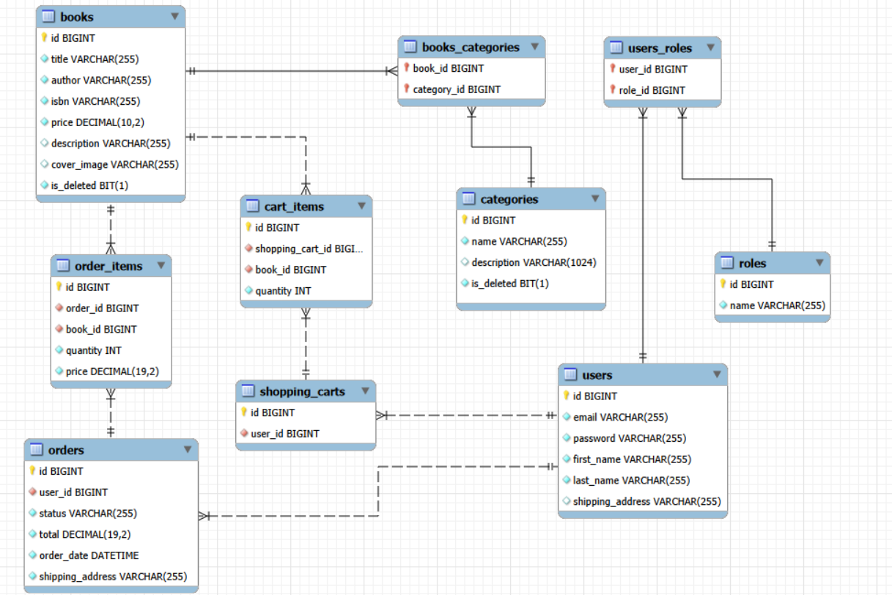
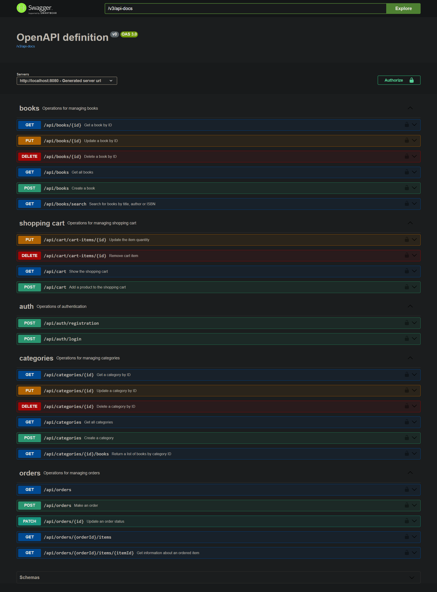
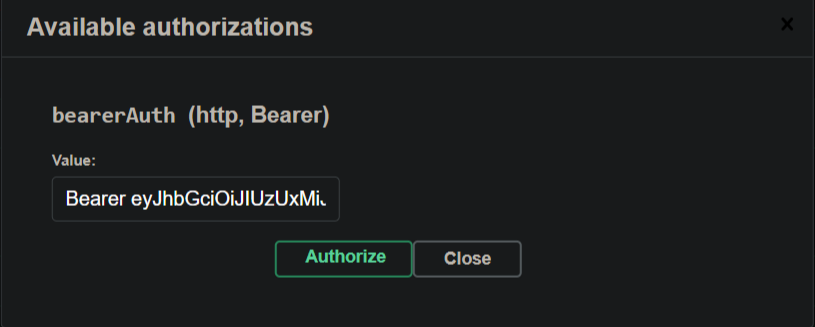
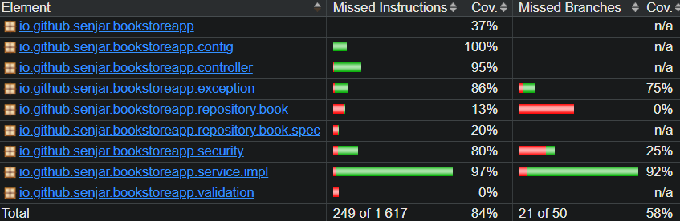
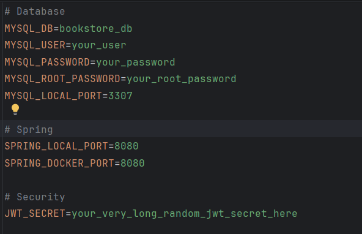

# 📚 Bookstore App

> A RESTful API for an online bookstore built with Java 17 and Spring Boot 3. The system implements a complete e-commerce lifecycle - from dynamic product cataloging and security-isolated shopping carts to historical price-snapped order fulfillment. Ready for cloud scale and deployed on AWS (EC2 & RDS).

## 🎥 Demo Video & Live Preview

📺 **[Watch the 3-minute Loom Walkthrough](https://www.loom.com/share/7124b0ce41fa43ea8c3122cee583c15c)**
*Full application walkthrough, user registration, and JWT authentication flow.*

🚀 **[Explore Live API (Swagger UI)](http://3.78.242.21:8080/swagger-ui/index.html#/orders)**
*Deployed on AWS EC2. Feel free to test the endpoints live.*
 
---

## 🛠️ Tech Stack

| Category | Technology |
| --- | --- |
| **Backend Core** | Java 17 / Spring Boot 3.3.4 / Maven |
| **Data Layer** | Spring Data JPA / Hibernate / MySQL 8.0 / H2 |
| **Cloud & Infrastructure** | **AWS EC2** (App Hosting) / **AWS RDS** (Managed MySQL) |
| **Migrations** | Liquibase |
| **Security** | Spring Security / JWT (`jjwt` 0.12.6) |
| **Utilities** | MapStruct / Lombok / Spring Validation |
| **API Docs** | springdoc-openapi (Swagger UI) |
| **Testing** | JUnit 5 / Mockito / Testcontainers (MySQL) / JaCoCo |
| **DevOps / CI** | Docker / Docker Compose / GitHub Actions / Checkstyle |
 
---

## 🗺️ Database Architecture (ERD)

The system enforces strict relational integrity and handles complex data logic across user roles, active carts, and frozen order snapshots.


 
---

## 📑 API Documentation (Swagger UI)

The API is fully documented and testable out of the box via Swagger UI. All endpoints (excluding login/registration) are protected using method-level security via JWT.



### 🧩 Main API Features

| Controller | Responsibility |
| --- | --- |
| **Auth Controller** | User registration and login, issues JWT access tokens |
| **Book Controller** | CRUD operations on the book catalog, dynamic search/filtering by title, author, ISBN |
| **Category Controller** | CRUD operations on book categories |
| **Shopping Cart Controller** | Add/update/remove items in the authenticated user's cart |
| **Order Controller** | Checkout, order history, and order item detail retrieval |

### 🔐 Authentication Flow

1. **Register a new user**
```bash
curl -X POST http://localhost:8080/api/auth/registration \
  -H "Content-Type: application/json" \
  -d '{
        "email": "user@example.com",
        "password": "yourPassword123",
        "repeatPassword": "yourPassword123",
        "firstName": "John",
        "lastName": "Doe"
      }'
```

2. **Log in and obtain a JWT**
```bash
curl -X POST http://localhost:8080/api/auth/login \
  -H "Content-Type: application/json" \
  -d '{
        "email": "user@example.com",
        "password": "yourPassword123"
      }'
```

The response returns a `token` field — copy its value.

3. **Authorize in Swagger UI**
   Open Swagger UI, click the **Authorize** button, and paste the token:
   

---

## 🧪 Testing & Code Coverage

The core application logic and runtime stability are thoroughly validated using a combined testing approach consisting of comprehensive **unit tests** alongside robust **integration tests**. The integration testing layer leverages **Testcontainers** to dynamically spin up real, isolated MySQL database instances inside Docker containers on the fly, eliminating environment mismatches during test execution.

This combined architecture ensures highly predictable behavior. Measured with JaCoCo (excluding generated Lombok/MapStruct code in `dto`, `mapper`, and `model`), the core business logic — services, controllers, security, repositories, and exception handling — achieves **84% instruction coverage**.



To reproduce this locally:

```bash
mvn clean test
```

JaCoCo generates a full HTML report at `target/site/jacoco/index.html`
 
---

## 🧗 Core Engineering Challenges & Solutions

* **Dynamic Product Filtering:** Implemented the **Specification + Specification Provider Manager** pattern for the `/api/books/search` endpoint. It dynamically builds JPA Criteria queries based on optional arrays of filters (title, author, ISBN) without messy boilerplate or unmaintainable repository code.
* **Historical Data Integrity:** To prevent future catalog changes from altering past invoices, the system takes a **value snapshot** of the book price, copying it directly into the `OrderItem` table at the exact millisecond of checkout.
* **Security & IDOR Isolation:** Removed all `userId` path parameters from client-facing endpoints (e.g., `/api/cart`). The system extracts the user identity directly from the crypto-signed JWT context via `Authentication.getPrincipal()`, ensuring complete tenant isolation.
* **Data Retention via Soft Deletes:** Utilized Hibernate `@SQLDelete` and `@SQLRestriction` to safely mark books and categories as inactive instead of executing hard SQL deletions, preventing cascading relational breakages on old orders.
* **Automated Quality Gates:** Hooked the Maven Checkstyle Plugin directly into the `compile` phase with `failsOnError=true`. Code that violates stylistic or layout constraints rejects local compilation instantly.
---

## 🚀 Instant Setup (Docker Compose)

Follow these steps to get the application up and running locally in a fully isolated containerized environment.

### 1. Clone the Repository

Clone the project repository and navigate to the project directory:

```bash
git clone https://github.com/Senjars/jv-portfolio-bookstore.git
cd jv-portfolio-bookstore
```

### 2. Configure Environment Variables

Copy the provided `.env.sample` file to `.env` in the project root, then fill in your own values:

```bash
cp .env.sample .env
```

```env
# Database
MYSQL_DB=bookstore_db
MYSQL_USER=your_user
MYSQL_PASSWORD=your_password
MYSQL_ROOT_PASSWORD=your_root_password
MYSQL_LOCAL_PORT=3307
 
# Spring
SPRING_LOCAL_PORT=8080
SPRING_DOCKER_PORT=8080
 
# Security
JWT_SECRET=your_very_long_random_jwt_secret_here
```

The screenshot below shows an example of a filled-in `.env` file:



### 3. Build and Run the Infrastructure

Start the application and all required services using Docker Compose. The build process will compile the application, run database migrations, and start all containers.

```bash
docker compose up --build
```

### 4. Verify the Application

Once all containers are running, open your browser and navigate to:

```text
http://localhost:8080/swagger-ui/index.html#/
```
 